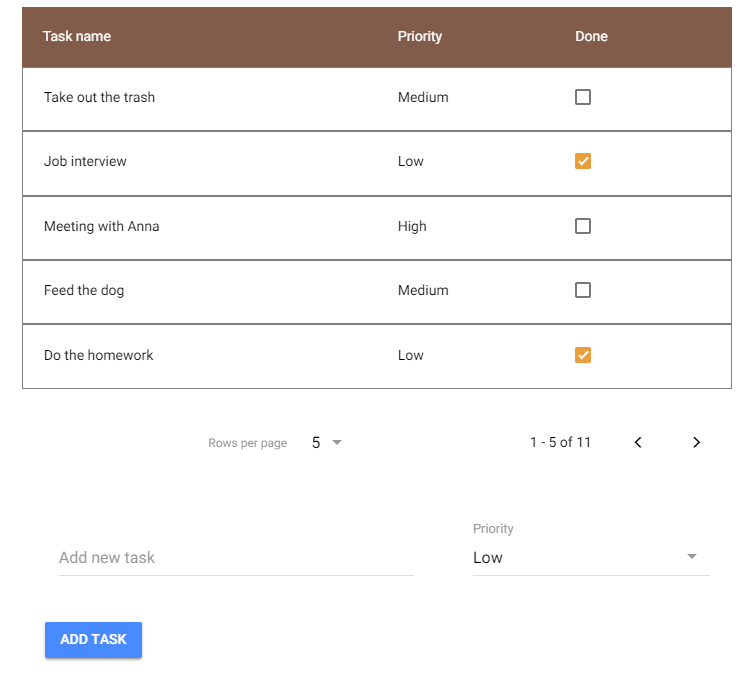
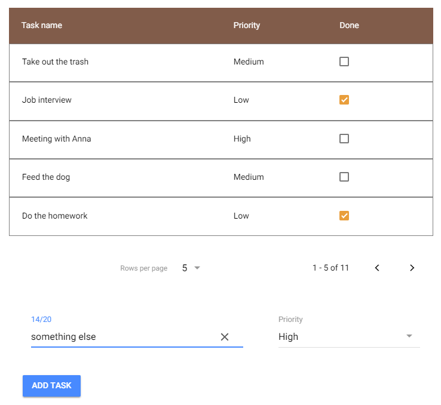
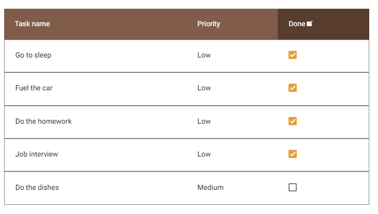
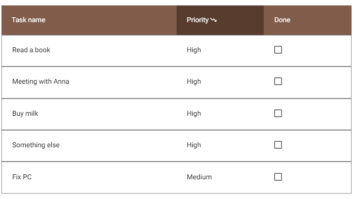
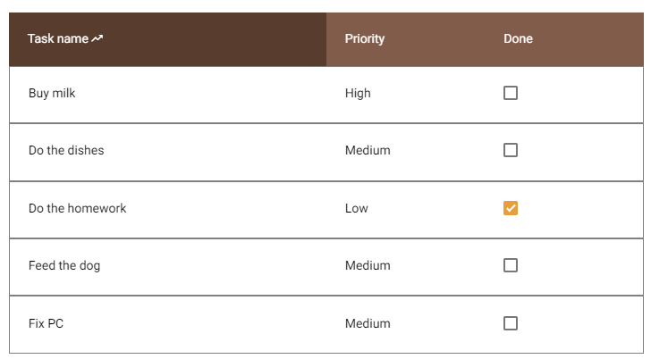

## A pageable and sortable to-do list with task's priority level


#

#

#

#


## Running the project
To run the app on an android device, download and install *todo-list.apk* file. Make sure You allowed for installation of apps from unknown sources in Your mobile device's settings.

To run the app on desktop:

* Download and install [NodeJS](https://nodejs.org/en/download/) 
* Download project by choosing *Clone or download* in the upper right corner and *Download zip*
* Unzip project and navigate to it's directory using command line
* Type the following command to install necessary modules
```sh
$ npm i
```
* After successful operation run the following command to build and run the project in a browser (access by typing *localhost:8100* by default in address bar)
```sh
$ npm start
```


